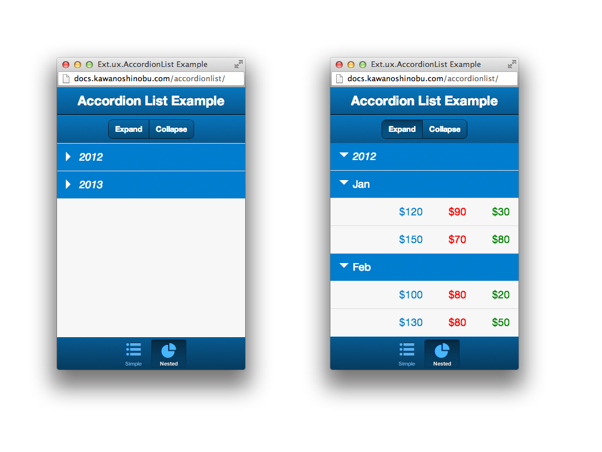

# Ext.ux.AccordionList

Sencha Touch 2 custom component.

Collapsible List with using Ext.data.TreeStore. You can expand and collapse contents by header item tap. Also it can nested infinity.

## Demo

- [Ext.ux.AccordionList Example](http://docs.kawanoshinobu.com/accordionlist)

## Document

- [http://docs.kawanoshinobu.com/touch/#!/api/Ext.ux.AccordionList](http://docs.kawanoshinobu.com/touch/#!/api/Ext.ux.AccordionList)

## Getting Started

### Initialization

Place the 'ux' folder somewhere within your application, then add the following to your app (at the top of 'app.js' is a good place):

    Ext.Loader.setPath({
        'Ext': 'touch/src',
        'MyApp': 'app',
        'Ext.ux': 'ux'
    });

Adjust './ux' to wherever you actually placed the 'ux' folder.

Then in whatever component you wish to use the view, add:

    requires = [
        'Ext.ux.AccordionList',
    ]

If you use default design, import _accordionlist.scss and include accordionlist mixin.

    // app.scss
    @import 'stylesheets/accordionlist';
    @include accordionlist;

Before build with Sencha Cmd, you must define "${add.dir}/ux" to sencha.cfg:

    app.classpath=${app.dir}/app.js,${app.dir}/ux,${app.dir}/app

### Example

Execute the following command in the sources root directory

    sencha ant -f project.xml initialize

Then to place example directory to server's application directory.

## Test

You can execute Jasmine and PhantomJS based unit test.

Example command line:

    phantomjs test/run-jasmine.js http://localhost:3333/Ext.ux.AccordionList/test/SpecRunner.html

You will need to run the tests from a web server because XHR's cannot be made from the file:// protocol

## Version

1.0.1

## Change log

[2013-06-15] **v1.0.1** KAWANO Shinobu (kawanoshinobu)

* Add singleMode feature
* Add animation feature
* Add showCount feature
* Add new example (decorate)

[2013-05-05] **v1.0.0** KAWANO Shinobu (kawanoshinobu)

* Update for Sencha Touch 2.2
* Refactoring code
* Add some utility config (headerItemCls, contentItemCls, useSelectedHighlights)
* Add new example
* Add Jasmine and Phantomjs based unit test
* Created API documentation

## license

Copyright (c) 2013 KAWANO Shinobu. This software is licensed under the MIT License.

